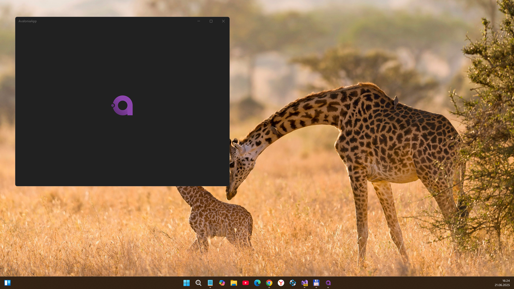
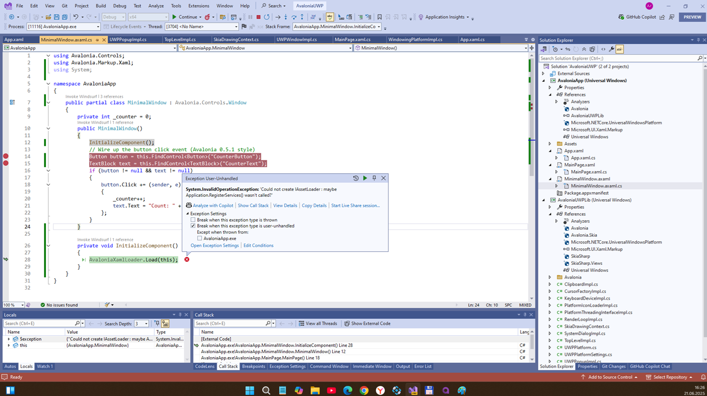

# AvaloniaUWP 0.6-alpha - main branch

Experimental UWP implementation for Avalonia. 

## About

I forked this [Pingzing's Avalonia-uwp-fork](https://github.com/pingzing/avalonia-uwp-fork) project.

## Screenshots

## Current status / Plan for future experiments

This is draft only…. but , in 2025, I "touched" all code with WindSurf AI in hope to improve AvaloniaUWPLib and Sample.. =)

## TODO
- Dream on some "AXAML" parser / visualider / loader… idk ...
- Todo some minimal working proto (ckick counter?)

## Referencies
- [Neil McAlister](https://github.com/pingzing)
- [AvaloniaUI](https://github.com/AvaloniaUI)
- [pingzing's avalonia-uwp-fork](https://github.com/pingzing/avalonia-uwp-fork) 
- [Gitter Discussion](https://gitter.im/AvaloniaUI/Avalonia?at=59cd68ff614889d4754ff3c7)

## ..

AS IS. No support. RnD only. DIY!

## .

- [m][e] June, 21 2025 

